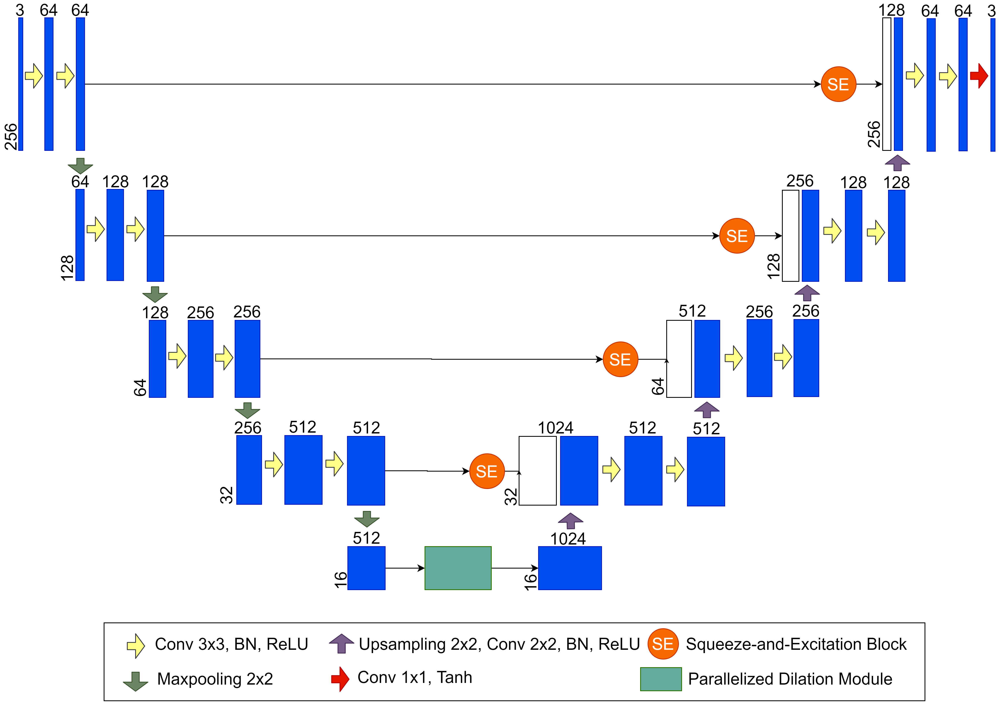
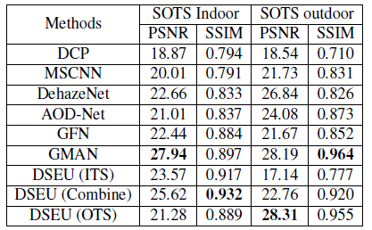

## Dilated Squeeze-and-Excitation U-net (DSEU)
An end-to-end convolutional network an for image dehazing. Our proposed U-Net based architecture employs Squeeze-and-Excitation (SE)
blocks at the skip connections to enforce channel-wise attention and parallelized dilated convolution blocks at the bottleneck to 
capture both local and global context, resulting in a richer representation of the image features.

## Training
The model is built using Tensorflow and Keras. Three training dataset are used for three different training. 

**Indoor Training Set (ITS)**: RESIDE: V0 ITS 13,990 images *(Note: has been updated to 110,000 images)*\
**Outdoor Training Set (OTS)**: RESIDE: V0 OTS 296,730 images *(Note: removed duplicated images in Synthetic Objective Test Set(SOTS) and corrupted images)*\
**Combine (ITS & OTS)**: 30,945 images (All 13,990 ITS and OTS images with B = 0.2 and A = 0.8 and 1 *(Note: we ran last few more iterations on ITS images only, to focus on dehazing strength)* \
**RESIDE: V0**: https://sites.google.com/view/reside-dehaze-datasets/reside-v0

## Evaluation
Average PSNR and SSIM on SOTS indoor and outdoor images.\

## Sample Visual Results
Input Image | DSEU(ITS) | DSEU(OTS) | DSEU(Combine)| Ground Truth |
------------|-----------|-----------|--------------|---------------

Full report:https://drive.google.com/file/d/1NjMLDqA9KukK3F5PZlF_BwVp27fBt6FW/view?usp=sharing 
Summary Paper: https://drive.google.com/file/d/13HYfw8dQl2exK8v2kl_O67zOW7mWxYPg/view?usp=sharing 
Model weights: https://drive.google.com/drive/folders/1UUGalqQeu3JTnu2wBUyPRQJodmznEI5q?usp=sharing
