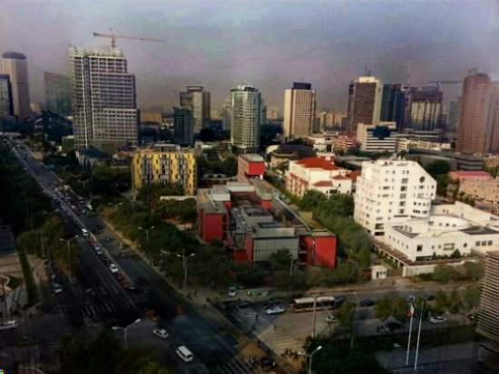
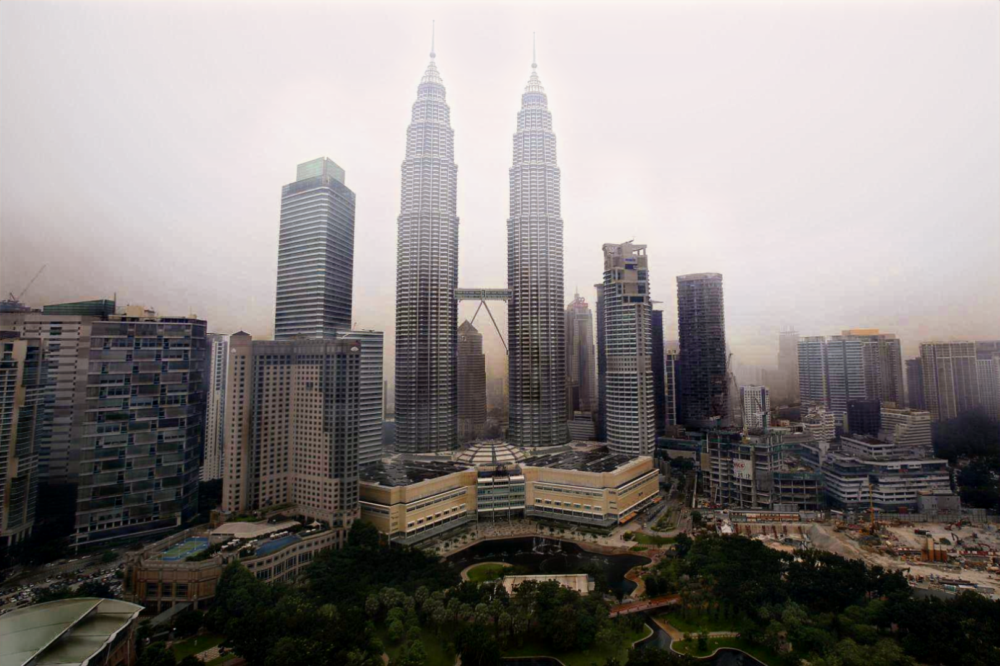

## Dilated Squeeze-and-Excitation U-net (DSEU)
An end-to-end convolutional network an for image dehazing. Our proposed U-Net based architecture employs Squeeze-and-Excitation (SE)
blocks at the skip connections to enforce channel-wise attention and parallelized dilated convolution blocks at the bottleneck to 
capture both local and global context, resulting in a richer representation of the image features.

## Training
The model is built using Tensorflow and Keras. Three training dataset are used for three different training. 

**Indoor Training Set (ITS)**: RESIDE: V0 ITS 13,990 images *(Note: has been updated to 110,000 images)*

**Outdoor Training Set (OTS)**: RESIDE: V0 OTS 296,730 images *(Note: removed duplicated images in Synthetic Objective Test Set(SOTS) and corrupted images)*

**Combine (ITS & OTS)**: 30,945 images (All 13,990 ITS and OTS images with B = 0.2 and A = 0.8 and 1 *(Note: we ran last few more iterations on ITS images only, to focus on dehazing strength)* 

**Download RESIDE: V0 dataset here**: https://sites.google.com/view/reside-dehaze-datasets/reside-v0

## Evaluation
Average PSNR and SSIM on Synthetic Objective Test Set(SOTS) indoor and outdoor images.\

## Sample Visual Results
Results on synthetic hazy images (HSTS)
Input Image | DSEU(ITS) | DSEU(Combine) | DSEU(OTS) | Ground Truth |
------------|-----------|---------------|-----------|---------------
 |  |  |  | 
 |  |  |  | 
 |  |  |  | 

Results on real hazy images
Input Image | DSEU(ITS) | DSEU(Combine) | DSEU(OTS)
------------|-----------|---------------|----------
 |  |  |  
 |  |  | 

**More Comparative Results on State-Of-The-Art on**: https://yeanwei97.github.io/dseuresultpage.github.io/

## Discussion & Recommendation
Although model trained on OTS have a better quantitative results, which is higher PSNR and SSIM. However, visually, the dehazing strength is better when trained with ITS and a more natural result can be produced when trained with Combine dataset.

As you can see above, some of the ground truth images contain haze. This situation also happen to OTS dataset. This may the reason results that trained on OTS does not perform visually well comparatively.

Therefore, I suggest people who wanted to train their own model on Reside V0 OTS to filter the dataset first / train with ITS which can generate stronger dehazing result.

Full report:https://drive.google.com/file/d/1NjMLDqA9KukK3F5PZlF_BwVp27fBt6FW/view?usp=sharing 
Summary Paper: https://drive.google.com/file/d/13HYfw8dQl2exK8v2kl_O67zOW7mWxYPg/view?usp=sharing 
Model weights: https://drive.google.com/drive/folders/1UUGalqQeu3JTnu2wBUyPRQJodmznEI5q?usp=sharing
